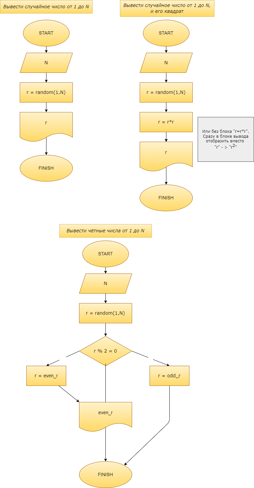
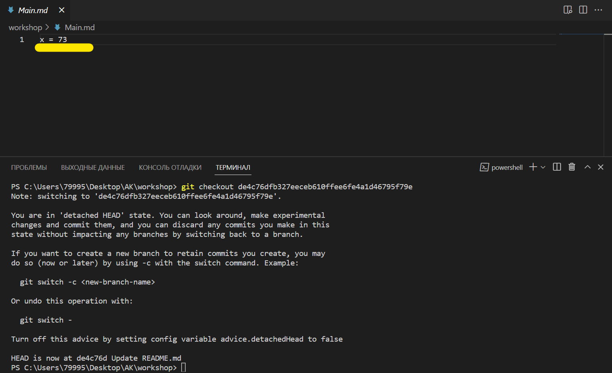
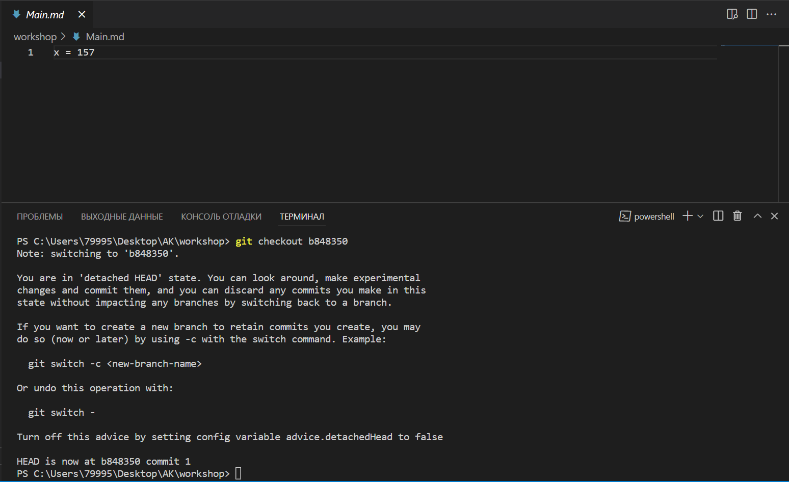
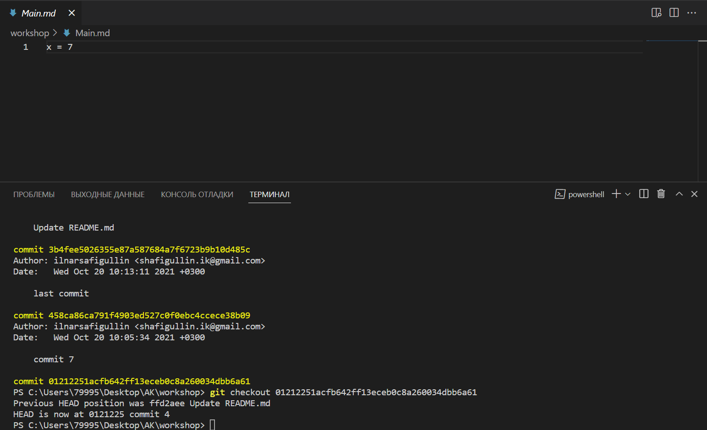
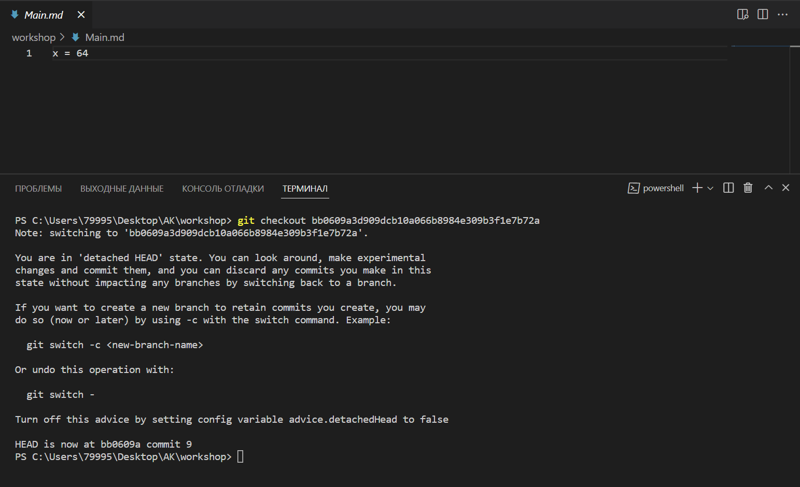
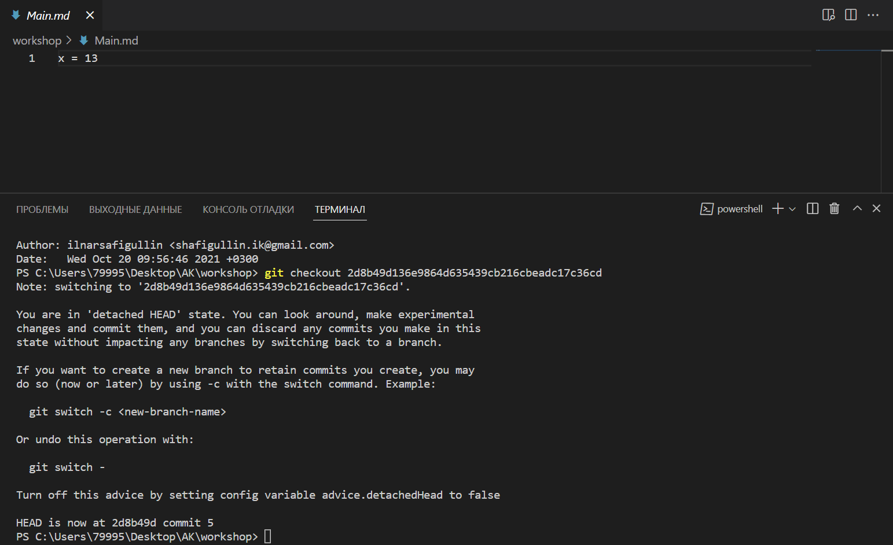
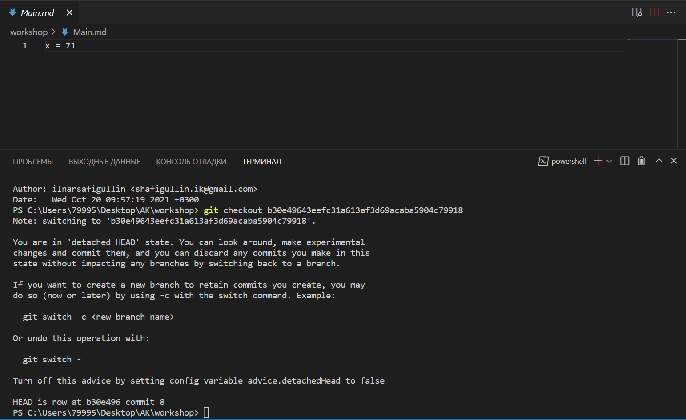

# ***Практикумы №1 от 16.07.22 и №2 от 17.07.22*** #

### ***1. Нарисовать блок-схемы задачи:*** ###
- показать на экран случайное число от 1 до N , 
- показать квадрат этого числа, 
- показать чётные числа от 1 до N.
Это будет отображено в файле:

### ***2. Чему равняется X (в тесте Практикума 2 выполняла параллельно, но в записи, поэтому отправляю сейчас):*** ###

### ***3. Вопрос:*** ###
    
    Что такое удаленный репозиторий и для чего он нужен?

### Ответ: ###

***Удаленный репозиторий*** - *хранилище файлов, расположенное на удалённом сервере*. Также данный вид репозиторий иногда именуют ***"внешним"***, так как он находится не на определённом компьютере, а в Интернете на сервере, к нему *можно получить доступ с других устройств*. 

Это и является ***целью удаленного репозитория***: *позволить* другим пользователям (или вам с другого устройства) *читать ваши файлы/ваш код или редактировать его*.